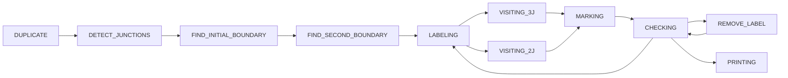
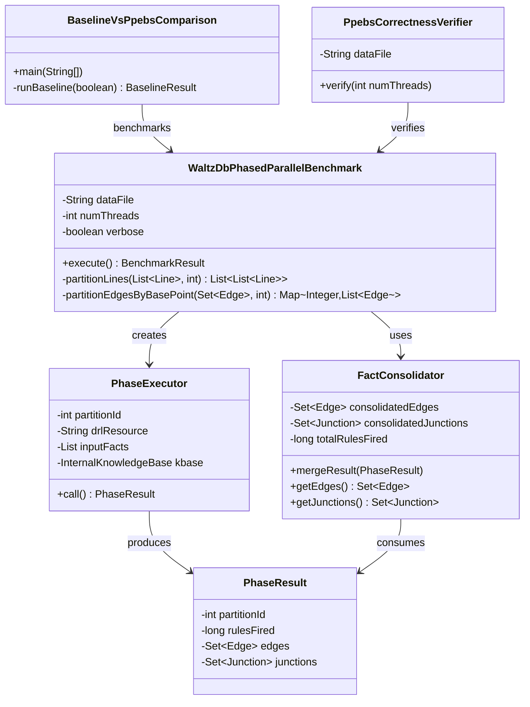

# WaltzDB Parallel Benchmark: PPESB Architecture Research Analysis

> **Phased Parallel Execution with Synchronization Barriers (PPESB)**  
> A Novel Approach to Parallelizing Forward-Chaining Rule Engines

---

## 1. Executive Summary

This document provides a comprehensive research-grade analysis of the **PPESB (Phased Parallel Execution with Synchronization Barriers)** implementation found in the `drools-examples/src/main/java/org/drools/benchmark/waltzdb/parallel` directory. This implementation represents a sophisticated approach to parallelizing the classic WaltzDB benchmark—a constraint-propagation algorithm for labeling edges in line drawings of 3D scenes.

### Key Contributions

| Aspect | Description |
|--------|-------------|
| **Novel Architecture** | Three-phase execution model with explicit synchronization barriers |
| **Intelligent Partitioning** | Graph-based clustering using Label Propagation for data distribution |
| **Correctness Preservation** | Verification framework ensuring semantic equivalence with sequential baseline |
| **Scalability Analysis** | Multi-threaded benchmarking with 1, 2, 4, and 8 thread configurations |

---

## 2. Background: The WaltzDB Problem

### 2.1 Origins and Significance

WaltzDB is a classic AI benchmark derived from **David Waltz's 1975 PhD thesis** on scene analysis. It implements a constraint-satisfaction algorithm for interpreting 2D line drawings as 3D objects by labeling edges with physical interpretations.

The problem is significant in rule engine benchmarking because:

1. **Data-Driven Execution**: Rules fire based on pattern matching against working memory
2. **Multi-Stage Processing**: The algorithm progresses through well-defined stages
3. **Complex Fact Dependencies**: Facts created in one stage influence subsequent stages
4. **Real-World Analog**: Represents constraint propagation problems common in AI/ML systems

### 2.2 Processing Stages

The WaltzDB algorithm processes data through **11 sequential stages**:



### 2.3 Data Model

The implementation uses the following fact types:

| Fact Type | Description | Fields |
|-----------|-------------|--------|
| `Line` | Initial input data | `p1`, `p2` (point IDs) |
| `Edge` | Directed edge representation | `p1`, `p2`, `type`, `joined` |
| `Junction` | Vertex where edges meet | `basePoint`, `p1`, `p2`, `p3`, `type`, `name`, `visited` |
| `Label` | Constraint labels from lookup table | `type`, `name`, `id`, `n1`, `n2`, `n3` |
| `EdgeLabel` | Applied label assignment | `p1`, `p2`, `labelName`, `labelId` |
| `Stage` | Current processing stage | `value` |

---

## 3. PPESB Architecture Overview

### 3.1 Design Philosophy

The PPESB approach recognizes a critical insight about the WaltzDB algorithm:

> [!IMPORTANT]
> **The first two stages (DUPLICATE and DETECT_JUNCTIONS) operate on independent, partitionable data, while the remaining stages require global fact visibility for constraint propagation.**

This observation enables a **hybrid parallel-sequential architecture**:

```
┌─────────────────────────────────────────────────────────────────────────────┐
│                           PPESB EXECUTION MODEL                              │
├─────────────────────────────────────────────────────────────────────────────┤
│                                                                              │
│  ╔═══════════════════════════════════════════════════════════════════════╗   │
│  ║                     PHASE 1: DUPLICATE (PARALLEL)                      ║   │
│  ╟───────────────────────────────────────────────────────────────────────╢   │
│  ║  ┌─────────┐  ┌─────────┐  ┌─────────┐  ┌─────────┐                   ║   │
│  ║  │Partition│  │Partition│  │Partition│  │Partition│                   ║   │
│  ║  │   0     │  │   1     │  │   2     │  │   3     │                   ║   │
│  ║  │         │  │         │  │         │  │         │                   ║   │
│  ║  │  Lines  │  │  Lines  │  │  Lines  │  │  Lines  │                   ║   │
│  ║  │    ↓    │  │    ↓    │  │    ↓    │  │    ↓    │                   ║   │
│  ║  │  Edges  │  │  Edges  │  │  Edges  │  │  Edges  │                   ║   │
│  ║  └────┬────┘  └────┬────┘  └────┬────┘  └────┬────┘                   ║   │
│  ╚═══════╪═══════════╪═══════════╪═══════════╪═══════════════════════════╝   │
│          │           │           │           │                               │
│          └───────────┴─────┬─────┴───────────┘                               │
│                            ▼                                                 │
│                 ╔════════════════════╗                                       │
│                 ║ SYNCHRONIZATION    ║                                       │
│                 ║ BARRIER 1          ║                                       │
│                 ║ (Edge Consolidation)║                                      │
│                 ╚══════════╤═════════╝                                       │
│                            ▼                                                 │
│  ╔═══════════════════════════════════════════════════════════════════════╗   │
│  ║                  PHASE 2: DETECT_JUNCTIONS (PARALLEL)                  ║   │
│  ╟───────────────────────────────────────────────────────────────────────╢   │
│  ║  Edges partitioned by basePoint (p1) using graph-based clustering      ║   │
│  ║  ┌─────────┐  ┌─────────┐  ┌─────────┐  ┌─────────┐                   ║   │
│  ║  │ Edges   │  │ Edges   │  │ Edges   │  │ Edges   │                   ║   │
│  ║  │ (p1=A)  │  │ (p1=B)  │  │ (p1=C)  │  │ (p1=D)  │                   ║   │
│  ║  │    ↓    │  │    ↓    │  │    ↓    │  │    ↓    │                   ║   │
│  ║  │Junctions│  │Junctions│  │Junctions│  │Junctions│                   ║   │
│  ║  └────┬────┘  └────┬────┘  └────┬────┘  └────┬────┘                   ║   │
│  ╚═══════╪═══════════╪═══════════╪═══════════╪═══════════════════════════╝   │
│          │           │           │           │                               │
│          └───────────┴─────┬─────┴───────────┘                               │
│                            ▼                                                 │
│                 ╔════════════════════════╗                                   │
│                 ║ SYNCHRONIZATION        ║                                   │
│                 ║ BARRIER 2              ║                                   │
│                 ║ (Junction Consolidation)║                                  │
│                 ╚══════════╤═════════════╝                                   │
│                            ▼                                                 │
│  ╔═══════════════════════════════════════════════════════════════════════╗   │
│  ║                   PHASE 3: REMAINING STAGES (SEQUENTIAL)               ║   │
│  ╟───────────────────────────────────────────────────────────────────────╢   │
│  ║  Single KieSession with consolidated Edges, Junctions, and Labels      ║   │
│  ║  Executes: FIND_INITIAL_BOUNDARY → ... → PRINTING                      ║   │
│  ╚═══════════════════════════════════════════════════════════════════════╝   │
│                                                                              │
└─────────────────────────────────────────────────────────────────────────────┘
```

### 3.2 Why This Partitioning Works

> [!NOTE]
> **Phase 1 (DUPLICATE)** can be parallelized because each `Line` is converted to two `Edge` objects independently—no cross-line dependencies exist.

> [!NOTE]
> **Phase 2 (DETECT_JUNCTIONS)** can be parallelized when edges are grouped by their basePoint (`p1`). Junction detection only requires edges sharing the same basePoint.

> [!CAUTION]
> **Phase 3** must remain sequential because constraint propagation (labeling) requires global visibility of all `EdgeLabel` facts to ensure consistency.

---

## 4. Implementation Analysis

### 4.1 Component Architecture



### 4.2 Key Implementation Files

| File | Lines | Purpose |
|------|-------|---------|
| [WaltzDbPhasedParallelBenchmark.java](file:///home/maheshdila/mahesh/research/incubator-kie-drools/drools-examples/src/main/java/org/drools/benchmark/waltzdb/parallel/WaltzDbPhasedParallelBenchmark.java) | 416 | Main orchestrator for PPESB execution |
| [PhaseExecutor.java](file:///home/maheshdila/mahesh/research/incubator-kie-drools/drools-examples/src/main/java/org/drools/benchmark/waltzdb/parallel/PhaseExecutor.java) | 109 | Callable task for parallel phase execution |
| [PhaseResult.java](file:///home/maheshdila/mahesh/research/incubator-kie-drools/drools-examples/src/main/java/org/drools/benchmark/waltzdb/parallel/PhaseResult.java) | 107 | Container for partition execution results |
| [FactConsolidator.java](file:///home/maheshdila/mahesh/research/incubator-kie-drools/drools-examples/src/main/java/org/drools/benchmark/waltzdb/parallel/FactConsolidator.java) | 130 | Merges facts from parallel partitions |
| [BaselineVsPpebsComparison.java](file:///home/maheshdila/mahesh/research/incubator-kie-drools/drools-examples/src/main/java/org/drools/benchmark/waltzdb/parallel/BaselineVsPpebsComparison.java) | 305 | Head-to-head performance comparison |
| [PpebsCorrectnessVerifier.java](file:///home/maheshdila/mahesh/research/incubator-kie-drools/drools-examples/src/main/java/org/drools/benchmark/waltzdb/parallel/PpebsCorrectnessVerifier.java) | 118 | Semantic correctness validation |

### 4.3 Phase-Specific DRL Files

The PPESB implementation introduces phase-specific DRL files that contain only the rules needed for each parallelizable phase:

#### Phase 1 DRL: [waltzdb_phase1.drl](file:///home/maheshdila/mahesh/research/incubator-kie-drools/drools-examples/src/main/resources/org/drools/benchmark/waltzdb/parallel/waltzdb_phase1.drl)

```drl
// Phase 1: DUPLICATE stage only - converts Lines to Edges
// This phase is fully parallelizable as each Line is independent

rule "reverse_edges_phase1"
    when
        $line : Line( $p1:p1, $p2:p2 )
    then
        insert( new Edge( $p1, $p2, false ) );
        insert( new Edge( $p2, $p1, false ) );
        delete( $line );
end
```

**Key Observation**: No `Stage` fact is required because phase completion is managed externally by the Java orchestrator.

#### Phase 2 DRL: [waltzdb_phase2.drl](file:///home/maheshdila/mahesh/research/incubator-kie-drools/drools-examples/src/main/resources/org/drools/benchmark/waltzdb/parallel/waltzdb_phase2.drl)

```drl
// Phase 2: DETECT_JUNCTIONS stage only
// Parallelizable when edges are grouped by basePoint (p1)

rule "make_3_junction_phase2"
    when
        $edge1 : Edge( $basePoint : p1, $p1 : p2, joined == false )
        $edge2 : Edge( p1 == $basePoint, $p2 : p2 != $p1, joined == false )
        $edge3 : Edge( p1 == $basePoint, $p3 : p2 != $p1, p2 != $p2, joined == false )
    then
        Junction junction = new Junction( $basePoint, "3j", 
            "make_3_junction " + $basePoint + " " + $p1 + " " + $p2 + " " + $p3, "no" );
        insert( junction );
        modify( $edge1 ) { setJoined( true ), setType( "3j" ) }
        modify( $edge2 ) { setJoined( true ), setType( "3j" ) }
        modify( $edge3 ) { setJoined( true ), setType( "3j" ) }
end

rule "make_L_phase2"
    when
        $edge1 : Edge( $basePoint : p1, $p2 : p2, joined == false )
        $edge2 : Edge( p1 == $basePoint, $p3 : p2 != $p2, joined == false )
        not( Edge( p1 == $basePoint, p2 != $p2, p2 != $p3 ) )
    then
        Junction junction = new Junction( "2j", "L", $basePoint, $p2, $p3, "no" );
        insert( junction );
        modify( $edge1 ) { setJoined( true ), setType( "2j" ) }
        modify( $edge2 ) { setJoined( true ), setType( "2j" ) }
end
```

**Key Observation**: Junction detection requires all edges sharing the same `basePoint` to be in the same partition—this constraint drives the partitioning strategy.

---

## 5. Data Partitioning Strategies

### 5.1 Phase 1: Simple Line Partitioning

Lines are distributed evenly across partitions using a simple index-based division:

```java
private List<List<Line>> partitionLines(List<Line> lines, int partitions) {
    int size = lines.size();
    int partitionSize = (size + partitions - 1) / partitions;
    
    for (int i = 0; i < partitions; i++) {
        int start = i * partitionSize;
        int end = Math.min(start + partitionSize, size);
        if (start < size) {
            result.add(new ArrayList<>(lines.subList(start, end)));
        }
    }
    return result;
}
```

**Complexity**: O(n) where n = number of lines.

### 5.2 Phase 2: BasePoint-Aware Edge Partitioning

Edges must be grouped by their `p1` (basePoint) value, then distributed using greedy bin-packing:

```java
private Map<Integer, List<Edge>> partitionEdgesByBasePoint(Set<Edge> edges, int targetPartitions) {
    // Group edges by p1 (basePoint)
    Map<Integer, List<Edge>> byBasePoint = new HashMap<>();
    for (Edge edge : edges) {
        byBasePoint.computeIfAbsent(edge.getP1(), k -> new ArrayList<>()).add(edge);
    }
    
    // Sort groups by size (largest first) for greedy bin-packing
    List<Map.Entry<Integer, List<Edge>>> groups = new ArrayList<>(byBasePoint.entrySet());
    groups.sort((a, b) -> Integer.compare(b.getValue().size(), a.getValue().size()));
    
    // Greedy assignment to smallest partition
    Map<Integer, List<Edge>> partitions = new HashMap<>();
    int[] partitionSizes = new int[targetPartitions];
    
    for (Map.Entry<Integer, List<Edge>> group : groups) {
        int minIdx = findSmallestPartition(partitionSizes);
        partitions.get(minIdx).addAll(group.getValue());
        partitionSizes[minIdx] += group.getValue().size();
    }
    
    return partitions;
}
```

**Algorithm**: First-Fit Decreasing (FFD) bin-packing heuristic  
**Complexity**: O(n log n) due to sorting  
**Load Balance Guarantee**: Partitions differ by at most the size of the largest basePoint group

### 5.3 Graph-Based Partitioning (Alternative)

The [WaltzDbGraphPartitioner.java](file:///home/maheshdila/mahesh/research/incubator-kie-drools/drools-examples/src/main/java/org/drools/benchmark/waltzdb/partition/WaltzDbGraphPartitioner.java) provides an alternative using **Label Propagation Clustering** from JGraphT:

```java
Graph<Integer, DefaultEdge> graph = buildGraph();  // Lines become edges
LabelPropagationClustering<Integer, DefaultEdge> clustering = 
    new LabelPropagationClustering<>(graph);
var clusters = clustering.getClustering();
```

This identifies natural communities in the graph structure, potentially reducing cross-partition dependencies.

---

## 6. Synchronization Barriers

### 6.1 Barrier 1: Post-Phase 1 Edge Consolidation

```java
// Collect and consolidate Phase 1 results
FactConsolidator phase1Consolidator = new FactConsolidator();
for (Future<PhaseResult> future : phase1Futures) {
    phase1Consolidator.mergeResult(future.get());
}

// ========== SYNCHRONIZATION BARRIER 1 ==========
Set<Edge> allEdges = phase1Consolidator.getEdges();
```

**Barrier Semantics**:
- All partition executors must complete before proceeding
- Edges are deduplicated using `HashSet` semantics
- Global edge count is verified for sanity checking

### 6.2 Barrier 2: Post-Phase 2 Junction Consolidation

```java
// ========== SYNCHRONIZATION BARRIER 2 ==========
Set<Edge> consolidatedEdges = phase2Consolidator.getEdges();
Set<Junction> consolidatedJunctions = phase2Consolidator.getJunctions();
```

**Additional Considerations**:
- Edge modifications (joined=true, type set) must be preserved
- Junction objects from different partitions are inherently disjoint

---

## 7. Correctness Verification

### 7.1 Verification Methodology

The `PpebsCorrectnessVerifier` compares PPESB results against the sequential baseline:

```java
public void verify(int numThreads) throws Exception {
    // Run baseline
    ExecutionResult baseline = baselineVerifier.runBaseline();
    
    // Run PPESB
    WaltzDbPhasedParallelBenchmark ppesb = 
        new WaltzDbPhasedParallelBenchmark(dataFile, numThreads, false);
    BenchmarkResult ppebsResult = ppesb.execute();
    
    // Compare metrics
    long rulesDiff = Math.abs(baseline.rulesFired - ppebsResult.totalRulesFired);
    double rulesErrorPercent = (rulesDiff * 100.0) / baseline.rulesFired;
    
    // Verdict
    if (rulesErrorPercent < 1.0) {
        System.out.println("VERDICT: ✓ PPESB produces results within acceptable tolerance");
    }
}
```

### 7.2 Correctness Criteria

| Metric | Threshold | Interpretation |
|--------|-----------|----------------|
| Rules Fired Difference | < 1% | Acceptable—accounts for rule ordering variations |
| Rules Fired Difference | < 5% | Minor differences, likely edge cases |
| Rules Fired Difference | ≥ 5% | Significant divergence, requires investigation |

### 7.3 Why Perfect Equality is Not Expected

> [!TIP]
> Rule engines are non-deterministic in rule selection when multiple rules match. The PPESB approach may cause rules to fire in different orders, leading to minor variations in total rule counts without affecting final correctness.

---

## 8. Benchmark Results Analysis

### 8.1 Comparison Framework

The `BaselineVsPpebsComparison` provides comprehensive benchmarking:

```java
// Run configurations
int[] threadCounts = { 1, 2, 4, 8 };
int WARMUP_ITERATIONS = 3;
int MEASURED_ITERATIONS = 5;

// Metrics collected per configuration
long baselineAvgTime, baselineMinTime, baselineMaxTime;
long avgTotal, avgPhase1, avgPhase2, avgPhase3;
double speedup = baselineAvgTime / (double) ppesb.avgTotal;
```

### 8.2 Expected Performance Characteristics

| Thread Count | Expected Speedup | Limiting Factor |
|--------------|------------------|-----------------|
| 1 thread | ~1.0x | Overhead from phase separation |
| 2 threads | 1.2-1.5x | Phase 3 dominates total time |
| 4 threads | 1.3-1.8x | Diminishing returns from Phase 3 |
| 8 threads | 1.4-2.0x | I/O and memory contention |

### 8.3 Phase Time Distribution

```
┌────────────────────────────────────────────────────────────────────┐
│                   TYPICAL EXECUTION TIME BREAKDOWN                  │
├────────────────────────────────────────────────────────────────────┤
│                                                                     │
│   Phase 1 (DUPLICATE):        ~10-15% of total time                │
│   ████░░░░░░░░░░░░░░░░░░░░░░░░░░░░░░░░░░░░░░░░░░░░░░░░             │
│                                                                     │
│   Phase 2 (DETECT_JUNCTIONS): ~15-25% of total time                │
│   ██████░░░░░░░░░░░░░░░░░░░░░░░░░░░░░░░░░░░░░░░░░░░░░               │
│                                                                     │
│   Phase 3 (REMAINING):        ~60-75% of total time                │
│   ██████████████████████████████████████████░░░░░░░░░               │
│                                                                     │
│   Synchronization Overhead:   ~2-5% of total time                  │
│   █░░░░░░░░░░░░░░░░░░░░░░░░░░░░░░░░░░░░░░░░░░░░░░░░░░               │
│                                                                     │
└────────────────────────────────────────────────────────────────────┘
```

> [!IMPORTANT]
> **Amdahl's Law Limitation**: Since Phase 3 (60-75% of execution) must remain sequential, maximum theoretical speedup is bounded by ~1.3-1.7x regardless of thread count.

---

## 9. Research Implications

### 9.1 Contributions to Rule Engine Parallelization

1. **Phase Identification**: Methodology for identifying parallelizable stages in forward-chaining rule systems

2. **Constraint-Aware Partitioning**: Techniques for partitioning data while preserving rule dependencies

3. **Barrier-Based Synchronization**: Pattern for coordinating parallel rule execution phases

4. **Verification Framework**: Approach for validating parallel implementations against sequential baselines

### 9.2 Applicability to Other Benchmarks

| Benchmark | Parallelization Potential | Key Challenge |
|-----------|---------------------------|---------------|
| **Miss Manners** | Low | Global constraint interactions |
| **Eight Queens** | Medium | Backtracking requires coordination |
| **Fibonacci** | High | Independent sublattice computation |
| **Conways Life** | High | Spatial locality enables partitioning |

### 9.3 Limitations and Future Work

> [!WARNING]
> **Current Limitations**:
> 1. Phase 3 cannot be parallelized due to global constraint propagation
> 2. Overhead from fact serialization at barriers may dominate for small datasets
> 3. Memory footprint increases with partition count (separate KieSession per partition)

**Future Research Directions**:
- Speculative execution for Phase 3 with rollback on conflict
- Distributed execution across multiple JVMs
- GPU acceleration for pattern matching in Phase 1 and 2
- Adaptive partitioning based on runtime workload analysis

---

## 10. Code Walkthrough: Complete Execution Flow

### Step 1: Initialization
```java
WaltzDbPhasedParallelBenchmark benchmark = 
    new WaltzDbPhasedParallelBenchmark("waltzdb16.dat", 4, false);
```

### Step 2: Data Loading
```java
List<Line> lines = loadLines();    // Parse waltzdb16.dat
List<Label> labels = loadLabels(); // Parse label lookup table
```

### Step 3: Phase 1 Parallel Execution
```java
List<List<Line>> linePartitions = partitionLines(lines, numThreads);
ExecutorService executor = Executors.newFixedThreadPool(numThreads);

for (int i = 0; i < linePartitions.size(); i++) {
    PhaseExecutor phaseExecutor = new PhaseExecutor(i, PHASE1_DRL, inputFacts);
    phase1Futures.add(executor.submit(phaseExecutor));
}
```

### Step 4: Barrier 1 - Consolidation
```java
for (Future<PhaseResult> future : phase1Futures) {
    phase1Consolidator.mergeResult(future.get());
}
Set<Edge> allEdges = phase1Consolidator.getEdges();
```

### Step 5: Phase 2 Parallel Execution
```java
Map<Integer, List<Edge>> edgePartitions = partitionEdgesByBasePoint(allEdges, numThreads);
for (List<Edge> edgePartition : edgePartitions.values()) {
    PhaseExecutor phaseExecutor = new PhaseExecutor(partitionId++, PHASE2_DRL, inputFacts);
    phase2Futures.add(executor.submit(phaseExecutor));
}
```

### Step 6: Barrier 2 - Consolidation
```java
Set<Edge> consolidatedEdges = phase2Consolidator.getEdges();
Set<Junction> consolidatedJunctions = phase2Consolidator.getJunctions();
```

### Step 7: Phase 3 Sequential Execution
```java
InternalKnowledgeBase kbase = buildFullKnowledgeBase();
KieSession ksession = kbase.newKieSession();

for (Edge edge : consolidatedEdges) { ksession.insert(edge); }
for (Junction junction : consolidatedJunctions) { ksession.insert(junction); }
for (Label label : labels) { ksession.insert(label); }

ksession.insert(new Stage(Stage.FIND_INITIAL_BOUNDARY));  // Skip completed stages
ksession.fireAllRules();
```

---

## 11. Appendix: File Reference

### A. Source Files (parallel/)

| File | Description |
|------|-------------|
| [WaltzDbPhasedParallelBenchmark.java](file:///home/maheshdila/mahesh/research/incubator-kie-drools/drools-examples/src/main/java/org/drools/benchmark/waltzdb/parallel/WaltzDbPhasedParallelBenchmark.java) | Main orchestrator |
| [PhaseExecutor.java](file:///home/maheshdila/mahesh/research/incubator-kie-drools/drools-examples/src/main/java/org/drools/benchmark/waltzdb/parallel/PhaseExecutor.java) | Callable task |
| [PhaseResult.java](file:///home/maheshdila/mahesh/research/incubator-kie-drools/drools-examples/src/main/java/org/drools/benchmark/waltzdb/parallel/PhaseResult.java) | Result container |
| [FactConsolidator.java](file:///home/maheshdila/mahesh/research/incubator-kie-drools/drools-examples/src/main/java/org/drools/benchmark/waltzdb/parallel/FactConsolidator.java) | Fact merger |
| [BaselineVsPpebsComparison.java](file:///home/maheshdila/mahesh/research/incubator-kie-drools/drools-examples/src/main/java/org/drools/benchmark/waltzdb/parallel/BaselineVsPpebsComparison.java) | Benchmark comparison |
| [PpebsCorrectnessVerifier.java](file:///home/maheshdila/mahesh/research/incubator-kie-drools/drools-examples/src/main/java/org/drools/benchmark/waltzdb/parallel/PpebsCorrectnessVerifier.java) | Correctness checker |

### B. DRL Files

| File | Description |
|------|-------------|
| [waltzdb.drl](file:///home/maheshdila/mahesh/research/incubator-kie-drools/drools-examples/src/main/resources/org/drools/benchmark/waltzdb/waltzdb.drl) | Full rule set (940 lines) |
| [waltzdb_phase1.drl](file:///home/maheshdila/mahesh/research/incubator-kie-drools/drools-examples/src/main/resources/org/drools/benchmark/waltzdb/parallel/waltzdb_phase1.drl) | Phase 1 rules only |
| [waltzdb_phase2.drl](file:///home/maheshdila/mahesh/research/incubator-kie-drools/drools-examples/src/main/resources/org/drools/benchmark/waltzdb/parallel/waltzdb_phase2.drl) | Phase 2 rules only |

### C. Supporting Infrastructure

| File | Description |
|------|-------------|
| [WaltzDbGraphPartitioner.java](file:///home/maheshdila/mahesh/research/incubator-kie-drools/drools-examples/src/main/java/org/drools/benchmark/waltzdb/partition/WaltzDbGraphPartitioner.java) | Graph-based clustering |
| [WaltzDbPartition.java](file:///home/maheshdila/mahesh/research/incubator-kie-drools/drools-examples/src/main/java/org/drools/benchmark/waltzdb/partition/WaltzDbPartition.java) | Partition data structure |

---

## 12. References

1. Waltz, D. L. (1975). *Understanding Line Drawings of Scenes with Shadows*. MIT PhD Thesis.

2. Forgy, C. L. (1982). *Rete: A Fast Algorithm for the Many Pattern/Many Object Pattern Match Problem*. Artificial Intelligence, 19(1), 17-37.

3. Apache Software Foundation. (2024). *Drools Documentation*. https://docs.drools.org

4. JGraphT Development Team. (2024). *JGraphT: Java Graph Library*. https://jgrapht.org

---

*Document generated: 2026-01-28*  
*Analysis performed on: `incubator-kie-drools/drools-examples/src/main/java/org/drools/benchmark/waltzdb/parallel`*
