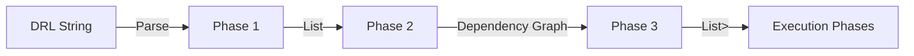

# DRL Rule Impact Analysis - Project Overview

A comprehensive static analysis toolkit for Drools Rule Language (DRL) files that enables **rule dependency analysis**, **graph visualization**, and **automatic phase stratification** for parallel rule execution.

---

## 📋 Table of Contents

1. [Project Architecture](#project-architecture)
2. [Analysis Pipeline](#analysis-pipeline)
3. [Phase 1: Rule Parsing](#phase-1-rule-parsing---drlruleparserph1)
4. [Phase 2: Dependency Graph Construction](#phase-2-dependency-graph-construction---dependencygraphbuilder)
5. [Phase 3: Stratification](#phase-3-stratification---stratifier)
6. [Integration & Visualization](#integration--visualization---waltzdbanalyzer)
7. [Data Flow Diagram](#data-flow-diagram)
8. [Use Cases](#use-cases)

---

## Project Architecture

```
┌──────────────────────────────────────────────────────────────────────────────┐
│                          DRL RULE IMPACT ANALYSIS                            │
├──────────────────────────────────────────────────────────────────────────────┤
│                                                                              │
│  ┌────────────┐    ┌──────────────┐    ┌─────────────────┐    ┌──────────┐  │
│  │  DRL File  │───▶│ DrlRuleParser│───▶│ DependencyGraph │───▶│Stratifier│  │
│  │  (Input)   │    │              │    │    Builder      │    │          │  │
│  └────────────┘    └──────────────┘    └─────────────────┘    └──────────┘  │
│                           │                    │                     │       │
│                           ▼                    ▼                     ▼       │
│                    ┌────────────┐      ┌─────────────┐      ┌────────────┐  │
│                    │List<Rule   │      │Graph<Rule   │      │List<Set<   │  │
│                    │   Meta>    │      │  Meta,Edge> │      │  String>>  │  │
│                    └────────────┘      └─────────────┘      └────────────┘  │
│                                                                              │
└──────────────────────────────────────────────────────────────────────────────┘
```

### Core Components

| Component | File | Responsibility |
|-----------|------|----------------|
| **RuleMeta** | `RuleMeta.java` | Data class storing rule name, inputs (LHS patterns), and outputs (RHS writes) |
| **DrlRuleParser** | `DrlRuleParser.java` | Parses DRL content using Drools' official parser, extracts rule metadata |
| **DependencyGraphBuilder** | `DependencyGraphBuilder.java` | Builds JGraphT directed graph based on data flow between rules |
| **Stratifier** | `Stratifier.java` | Computes execution phases using SCC analysis and topological sort |
| **WaltzDbAnalyzer** | `WaltzDbAnalyzer.java` | Integration test with beautiful ANSI-colored console output |
| **Main** | `Main.java` | Simple demo showcasing API usage |

---

## Analysis Pipeline

The analysis follows a **3-phase pipeline**, where each phase produces distinct outputs:



---

## Phase 1: Rule Parsing - `DrlRuleParser`

### Purpose
Extract structured metadata from DRL rule definitions, identifying what each rule **reads** (LHS patterns) and **writes** (RHS operations).

### Algorithm

1. Parse DRL using `org.drools.drl.parser.DrlParser` with DRL6 language level
2. For each rule:
   - Traverse LHS `PatternDescr` nodes recursively, handling nested `not`, `exists`, `or` elements
   - Build variable-to-type mapping (e.g., `$p` → `Person`)
   - Extract RHS operations using regex patterns for `insert`, `modify`, `delete`, `update`, `retract`
   - Resolve variable references to their LHS types

### Input
```java
String drlContent = """
    rule "example"
    when
        $p: Person(age > 18)
    then
        modify($p){ setStatus("adult") };
        insert(new AuditLog());
    end
    """;
```

### Output: `List<RuleMeta>`

```java
RuleMeta {
    ruleName = "example",
    inputs   = [Person],        // LHS patterns (what rule reads)
    outputs  = [Person, AuditLog] // RHS writes (modify + insert)
}
```

### Supported DRL Features

| Category | Feature | Example |
|----------|---------|---------|
| **LHS Patterns** | Simple patterns | `Person()` |
| | Constrained patterns | `Person(age > 18)` |
| | Bound variables | `$p : Person()` |
| | Nested conditionals | `not( exists( Violation() ) )` |
| **RHS Operations** | Insert | `insert(new Type())` |
| | Insert Logical | `insertLogical(new Type())` |
| | Modify | `modify($var) { ... }` |
| | Update | `update($var)` |
| | Delete | `delete($var)` |
| | Retract | `retract($var)` | check the diff with delete

---

## Phase 2: Dependency Graph Construction - `DependencyGraphBuilder`

### Purpose
Build a **directed graph** representing data dependencies between rules. An edge `A → B` means "Rule A's output may trigger Rule B".

### Algorithm

1. Create a `DefaultDirectedGraph<RuleMeta, DefaultEdge>` using JGraphT
2. Add all rules as vertices
3. For each pair of rules `(A, B)`:
   - Compute intersection: `A.outputs ∩ B.inputs`
   - **Filter out control facts** (`Stage`, `Illegal`) that manage execution flow but don't represent data flow
   - If non-empty intersection remains, create edge `A → B`

### Input: `List<RuleMeta>` (from Phase 1)

### Output: `Graph<RuleMeta, DefaultEdge>`

```
Dependency Graph (Adjacency List):
=================================
reverse_edges -> make_3_junction, make_L_junction, ...
make_3_junction -> label_junction, ...
make_L_junction -> label_junction, ...
done_plotting -> (no outgoing edges)
```

### Key Design Decision: Control Fact Filtering

```java
// Control facts that are filtered out to avoid false dependencies
private static final Set<String> CONTROL_FACTS = Set.of("Stage", "Illegal");
```

**Why?** Control facts like `Stage` are used to coordinate rule execution phases but don't represent actual data flow. Including them would create false cycles where almost all rules appear mutually dependent.

### API Methods

| Method | Return Type | Description |
|--------|-------------|-------------|
| `getGraph()` | `Graph<RuleMeta, DefaultEdge>` | Returns the JGraphT graph |
| `getPredecessors(rule)` | `Set<RuleMeta>` | Rules that may trigger this rule |
| `getSuccessors(rule)` | `Set<RuleMeta>` | Rules this rule may trigger |
| `hasEdge(a, b)` | `boolean` | Check if direct dependency exists |
| `isIsolated(rule)` | `boolean` | Check if rule has no in/out edges |

---

## Phase 3: Stratification - `Stratifier`

### Purpose
Partition rules into **execution phases** where rules in the same phase can potentially run in parallel, but phases must execute sequentially.

### Algorithm

1. **Detect Strongly Connected Components (SCCs)** using Kosaraju's algorithm
   - Rules in an SCC form a cycle and **must be in the same phase**
2. **Build condensation graph** where each SCC becomes a single "super-node"
3. **Compute layers** using Kahn's algorithm (topological sort with level assignment)
   - Layer 0 = nodes with in-degree 0 (Phase 1)
   - Layer N = nodes whose all predecessors are in layers < N

### Input: `List<RuleMeta>` or `DependencyGraphBuilder`

### Output: `List<Set<String>>`

Each element in the list represents a phase, containing rule names that can execute in that phase.

```java
List<Set<String>> phases = stratifier.stratify();

// Example output for WaltzDB:
// Phase 1: [reverse_edges]                           - Bootstrap phase
// Phase 2: [make_3_junction, make_L_junction, ...]   - Main processing (33 rules)
```

### Phase Semantics

| Phase | Meaning |
|-------|---------|
| Phase 1 | Rules with no dependencies (can start immediately) |
| Phase N | Rules that depend only on rules in phases 1..(N-1) |

> **Key Insight:** All rules within a phase have no mutual dependencies, making them candidates for parallel execution.

### Cycle Handling

```java
// Detect cycles
boolean hasCycles = stratifier.hasCycles();

// Get cyclic components (SCCs with >1 rule)
List<Set<RuleMeta>> cycles = stratifier.getCyclicComponents();
```

When cycles exist, all rules in the cycle are placed in the same phase, as they can trigger each other indefinitely.

---

## Integration & Visualization - `WaltzDbAnalyzer`

### Purpose
The "golden" integration test that demonstrates the complete analysis pipeline with beautiful console output.

### Features
- ANSI-colored output with box-drawing characters
- Summary statistics (rules, edges, phases)
- Per-phase visualization with rule listings
- Parallelization potential analysis
- Command-line options (`--verbose`, `--help`)

### Execution Flow

```
┌──────────────────────────────────────────────────────────────────────────────┐
│                           WaltzDbAnalyzer Pipeline                           │
├──────────────────────────────────────────────────────────────────────────────┤
│                                                                              │
│  Step 1: Load DRL File                                                       │
│    └─ Read file, validate existence, report size/lines                       │
│                                                                              │
│  Step 2: Parse Rules                                                         │
│    └─ DrlRuleParser.parse() → List<RuleMeta>                                 │
│    └─ Report: total rules, unique input/output types                         │
│                                                                              │
│  Step 3: Build Dependency Graph                                              │
│    └─ DependencyGraphBuilder → Graph<RuleMeta, DefaultEdge>                  │
│    └─ Report: vertices, edges, isolated rules                                │
│                                                                              │
│  Step 4: Stratify into Phases                                                │
│    └─ Stratifier.stratify() → List<Set<String>>                              │
│    └─ Display: phase boxes with rule listings                                │
│                                                                              │
│  Step 5: Detailed Rule Metadata                                              │
│    └─ Show inputs/outputs for each rule (10 or all if --verbose)             │
│                                                                              │
│  Step 6: Final Summary                                                       │
│    └─ Statistics, phase breakdown bar chart, parallelization potential       │
│                                                                              │
└──────────────────────────────────────────────────────────────────────────────┘
```

### Sample Output

```
╔══════════════════════════════════════════════════════════════════════════════╗
║   DRL ANALYZER - Rule Dependency Graph & Phase Stratification Tool           ║
╚══════════════════════════════════════════════════════════════════════════════╝

📊 Summary:
   • Total rules parsed:      34
   • Dependency edges:        758
   • Execution phases:        2
   • Contains cycles:         Yes

📈 Phase Breakdown:
   Phase 1: ██ 1 rules
   Phase 2: ████████████████████████████████████████ 33 rules

⚡ Parallelization Potential:
   • Max rules per phase:     33
   • Sequential phases:       2
```

---

## Data Flow Diagram

```
┌─────────────────────────────────────────────────────────────────────────────┐
│                                                                             │
│                         COMPLETE DATA FLOW                                  │
│                                                                             │
│  ┌─────────────────────────────────────────────────────────────────────┐   │
│  │                        INPUT                                        │   │
│  │                                                                     │   │
│  │   waltzdb.drl (or any DRL file)                                     │   │
│  │   ├── package declaration                                           │   │
│  │   ├── imports                                                        │   │
│  │   └── rules[]                                                        │   │
│  │       ├── when (LHS patterns)                                        │   │
│  │       └── then (RHS actions)                                         │   │
│  │                                                                     │   │
│  └─────────────────────────────────────────────────────────────────────┘   │
│                                      │                                      │
│                                      ▼                                      │
│  ┌─────────────────────────────────────────────────────────────────────┐   │
│  │                   PHASE 1: DrlRuleParser                            │   │
│  │                                                                     │   │
│  │   Output: List<RuleMeta>                                            │   │
│  │   ┌────────────────────────────────────────────────────────────┐   │   │
│  │   │ RuleMeta("reverse_edges")                                   │   │   │
│  │   │   inputs:  [Line]                                           │   │   │
│  │   │   outputs: [Edge]                                           │   │   │
│  │   ├────────────────────────────────────────────────────────────┤   │   │
│  │   │ RuleMeta("make_3_junction")                                 │   │   │
│  │   │   inputs:  [Edge]                                           │   │   │
│  │   │   outputs: [Junction]                                       │   │   │
│  │   ├────────────────────────────────────────────────────────────┤   │   │
│  │   │ ... (34 total rules)                                        │   │   │
│  │   └────────────────────────────────────────────────────────────┘   │   │
│  │                                                                     │   │
│  └─────────────────────────────────────────────────────────────────────┘   │
│                                      │                                      │
│                                      ▼                                      │
│  ┌─────────────────────────────────────────────────────────────────────┐   │
│  │               PHASE 2: DependencyGraphBuilder                       │   │
│  │                                                                     │   │
│  │   Output: Graph<RuleMeta, DefaultEdge>                              │   │
│  │                                                                     │   │
│  │   reverse_edges ─┬─────────────────────▶ make_3_junction            │   │
│  │                  │                                                  │   │
│  │                  └─────────────────────▶ make_L_junction            │   │
│  │                                                │                    │   │
│  │   make_3_junction ─────────────────────▶ label_junction             │   │
│  │                                                │                    │   │
│  │   make_L_junction ─────────────────────▶ label_junction             │   │
│  │                                                │                    │   │
│  │   ... (758 total edges)                        ▼                    │   │
│  │                                         done_plotting               │   │
│  │                                                                     │   │
│  └─────────────────────────────────────────────────────────────────────┘   │
│                                      │                                      │
│                                      ▼                                      │
│  ┌─────────────────────────────────────────────────────────────────────┐   │
│  │                   PHASE 3: Stratifier                               │   │
│  │                                                                     │   │
│  │   Algorithm:                                                        │   │
│  │   1. Detect SCCs (Kosaraju)                                         │   │
│  │   2. Build condensation graph                                       │   │
│  │   3. Topological layering (Kahn's)                                  │   │
│  │                                                                     │   │
│  │   Output: List<Set<String>>                                         │   │
│  │   ┌────────────────────────────────────────────────────────────┐   │   │
│  │   │ Phase 1: { "reverse_edges" }                                │   │   │
│  │   ├────────────────────────────────────────────────────────────┤   │   │
│  │   │ Phase 2: { "make_3_junction", "make_L_junction",            │   │   │
│  │   │            "label_junction", ..., "done_plotting" }         │   │   │
│  │   │           (33 rules - can run in parallel)                  │   │   │
│  │   └────────────────────────────────────────────────────────────┘   │   │
│  │                                                                     │   │
│  └─────────────────────────────────────────────────────────────────────┘   │
│                                                                             │
└─────────────────────────────────────────────────────────────────────────────┘
```

---

## Use Cases

| Use Case | Description |
|----------|-------------|
| **Static Analysis** | Understand rule dependencies without running the engine |
| **Impact Analysis** | Identify which rules are affected when modifying a fact type |
| **Documentation** | Generate rule dependency diagrams for documentation |
| **Parallel Execution** | Identify rules that can safely execute in parallel |
| **Refactoring** | Find isolated rules, detect cycles, understand data flow |
| **Optimization** | Identify bottleneck phases with high rule counts |

---

## Dependencies

| Library | Purpose |
|---------|---------|
| `drools-engine` | DRL parsing via `DrlParser` |
| `jgrapht-core` | Graph algorithms (SCC, topological sort) |
| `junit-jupiter` | Unit testing |

---

## Running the Analyzer

```bash
cd /home/maheshdila/mahesh/research/incubator-kie-drools

# Default WaltzDB analysis
mvn compile exec:java -pl drools-impact-analysis/drools-impact-analysis-parser \
    -Dexec.mainClass="org.drools.impact.research.WaltzDbAnalyzer" -q

# Verbose mode (show all rules)
mvn compile exec:java -pl drools-impact-analysis/drools-impact-analysis-parser \
    -Dexec.mainClass="org.drools.impact.research.WaltzDbAnalyzer" \
    -Dexec.args="--verbose" -q

# Custom DRL file
mvn compile exec:java -pl drools-impact-analysis/drools-impact-analysis-parser \
    -Dexec.mainClass="org.drools.impact.research.WaltzDbAnalyzer" \
    -Dexec.args="/path/to/custom.drl" -q
```

---

## License

Licensed under the Apache License, Version 2.0.
